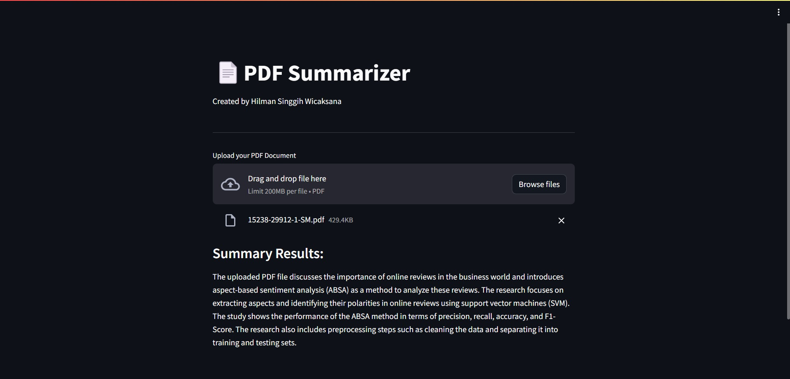

# PDF Summarizer

## Description
The system is built with the aim of summarising a PDF file uploaded by the user. This system was created by Hilman Singgih Wicaksana using Streamlit, LangChain, and OpenAI frameworks.

## Preview
To be able to see a preview of this system, please see the following link: https://pdf-summarizer.streamlit.app/, or check out the preview below.



## How to Use
In the lines of program code below, change ``YOUR_OPENAI_API_KEY`` to match your OPENAI API KEY. This line of code can be found in the ``openai.env`` file.

```bash
OPENAI_API_KEY=YOUR_OPENAI_API_KEY
```
